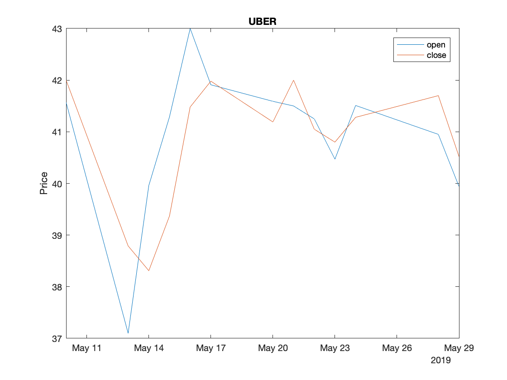

Figure 1: UBER open vs close.

# Kotlin JSON Processor

This is a project with some tests around processing daily stock data with Kotlin
and the Klaxon JSON parser for learning and evaluation.

# Running

`$ ./gradlew run`

# Testing

`$ ./gradlew test`
